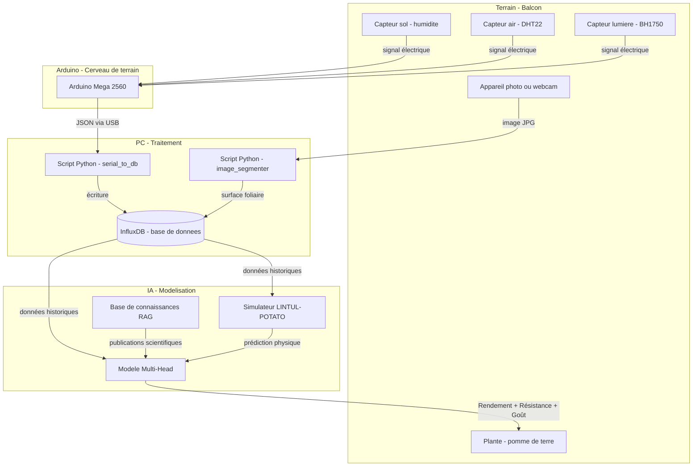
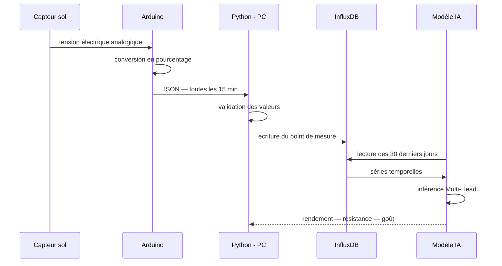

# 01 — Vue d'ensemble du projet SRB

## Ce qu'on construit

Un **système cyber-physique** : un montage qui mêle le monde physique (capteurs, plante, lumière) et le monde numérique (données, algorithmes, prédictions).

L'objectif final : avoir un logiciel capable de dire, à partir des conditions de culture observées, **quelle variété de pomme de terre donnera le meilleur résultat** sur un balcon — en termes de rendement, de robustesse et de goût.

---

## Schéma général du système

---

## Les quatre phases de livraison

| Phase | Contenu | État |
|-------|---------|------|
| **Phase 1** — Acquisition | `serial_to_db.py` — lecture Arduino → InfluxDB | ✅ fait |
| **Phase 2** — Vision | `image_segmenter.py` — segmentation foliaire YOLOv8 | 🔲 à faire |
| **Phase 3** — Modélisation | LINTUL wrapper + Multi-Head IA + RAG | 🔲 à faire |
| **Phase 4** — Interface web | Dashboard FastAPI + JS — état plante + 3 prédictions | 🔲 à faire |

---

## Les trois modules du projet

### Module A — Acquisition IoT

**Rôle :** Mesurer en continu l'environnement de la plante et envoyer ces mesures au PC.

- Matériel : Arduino Mega 2560 + 3 capteurs
- Fréquence : toutes les 15 minutes
- Format : JSON (texte structuré) via câble USB

### Module B — Vision par ordinateur

**Rôle :** Analyser des photos de la plante pour mesurer sa surface foliaire (proxy de la biomasse).

- Entrée : une photo prise manuellement (ou par webcam)
- Traitement : détection des feuilles, calcul de la surface verte
- Sortie : un nombre — la "biomasse visuelle" en cm²

### Module C — Modélisation hybride

**Rôle :** Combiner les données de terrain et la connaissance scientifique pour prédire trois variables.

- **Rendement** : combien de tubercules, en grammes
- **Résistance** : probabilité que la plante survive à un stress (sécheresse, canicule)
- **Goût** : score estimé (sucre, texture, arôme) basé sur l'historique

---

## Flux de données — du capteur à la prédiction

---

## Pourquoi ces choix technologiques ?

| Besoin | Solution choisie | Alternative écartée | Raison |
|--------|-----------------|--------------------|----|
| Lire des capteurs | Arduino | Raspberry Pi | L'Arduino est plus simple, consomme moins, ne plante pas |
| Stocker des mesures | InfluxDB | SQLite / PostgreSQL | InfluxDB est fait pour des données horodatées en série |
| Isoler les services | Docker | Installation directe | Docker évite les conflits de versions entre projets |
| Détecter les feuilles | YOLOv8 | OpenCV seul | YOLOv8 reconnaît les formes complexes, OpenCV seul ne suffit pas |
| Modèle physique | LINTUL-POTATO | Modèle IA pur | Un modèle purement IA nécessite des milliers d'exemples qu'on n'a pas |
| Connaissances scientifiques | RAG + ChromaDB | Fine-tuning LLM | Le RAG permet d'interroger des articles sans ré-entraîner un modèle |

---

## Ce que le projet N'est PAS

- Ce n'est **pas** un système de contrôle automatique (pas de pompe, pas d'arrosage auto — pour l'instant).
- Ce n'est **pas** une application grand public. C'est un outil de recherche personnelle.
- Ce n'est **pas** un projet "temps réel" : les mesures toutes les 15 min sont largement suffisantes pour observer la croissance d'une plante.
