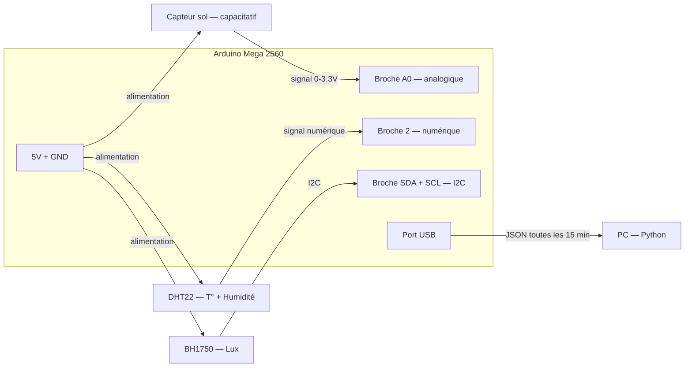

# 02 — Hardware & Capteurs

## 🔩 Arduino Mega 2560

### Ce que c'est

Un **microcontrôleur** : une minuscule carte électronique programmable, plus proche d'un interrupteur intelligent que d'un ordinateur.

💡 **Analogie :** L'Arduino, c'est le vigile à l'entrée d'une usine. Il ne réfléchit pas beaucoup, mais il fait très bien une chose : surveiller les signaux qui arrivent et les relayer au bon endroit. Ton PC, lui, c'est le directeur de l'usine qui analyse et décide.

### Pourquoi le Mega et pas un Arduino Uno ?

| Modèle | Broches analogiques | Mémoire programme | Prix |
|--------|--------------------|--------------------|------|
| Arduino Uno | 6 | 32 KB | ~20 € |
| Arduino Mega 2560 | **16** | **256 KB** | ~40 € |

Le Mega a plus de "prises" pour brancher des capteurs et plus de mémoire pour stocker le code. Avec 3 capteurs aujourd'hui et potentiellement d'autres demain, le Mega est le bon choix.

### Comment on le programme ?

On écrit du code en C++ simplifié (le "langage Arduino"), on le téléverse via USB depuis le PC, et ensuite l'Arduino tourne **indépendamment**, même si le PC est éteint — tant qu'il est alimenté.

```
[PC] --(câble USB)--> [Arduino] : envoi du programme une seule fois
[PC] <--(câble USB)-- [Arduino] : envoi des données en continu ensuite
```

---

## 🔩 Capteur d'humidité du sol (capacitatif)

### Ce que c'est

Une sonde qu'on plante dans la terre. Elle mesure la **résistance électrique du sol** : la terre humide conduit mieux l'électricité que la terre sèche.

### Pourquoi "capacitatif" et pas "résistif" ?

Il existe deux types de capteurs d'humidité sol :

| Type | Principe | Durée de vie | Précision |
|------|----------|-------------|-----------|
| Résistif | Deux électrodes métalliques dans le sol | Courte (corrosion rapide) | Moyenne |
| **Capacitatif** | Mesure un champ électrique, pas de contact direct | Longue | Bonne |

On utilise le type capacitatif pour éviter de devoir changer le capteur toutes les semaines.

### Ce qu'il envoie à l'Arduino

Un **signal analogique** entre 0 et 3.3 V. L'Arduino le convertit en valeur entre 0 et 100 (%) dans le code. Exemple :
- Sol totalement sec → ~10 %
- Sol bien humide → ~70 %
- Sol saturé d'eau → ~90-100 %

⚠️ Ces pourcentages sont **relatifs** : il faut calibrer le capteur dans ton sol spécifique au démarrage.

---

## 🔩 Capteur DHT22 — Température et Humidité de l'air

### Ce que c'est

Un petit boîtier bleu/blanc avec 3 broches qui mesure simultanément :
- La **température de l'air** (précision ±0.5 °C)
- Le **taux d'humidité relative de l'air** (précision ±2-5 %)

### Pourquoi c'est important pour la pomme de terre ?

- La pomme de terre pousse mieux entre **15 et 20 °C**. Au-delà de 25 °C, la formation des tubercules ralentit.
- Une humidité de l'air trop basse accélère l'évapotranspiration (la plante "sèche de l'intérieur").
- Ces deux variables sont des **facteurs de stress** que le modèle IA devra apprendre à interpréter.

### Comment il communique avec l'Arduino ?

Le DHT22 utilise un protocole **numérique** propriétaire (pas analogique). L'Arduino envoie un signal de "réveil", le DHT22 répond avec une séquence de 40 bits encodant température et humidité.

💡 **Analogie :** C'est comme envoyer un SMS à quelqu'un et attendre sa réponse, plutôt que de lire un thermomètre à aiguille.

---

## 🔩 Capteur BH1750 — Luminosité

### Ce que c'est

Un capteur de lumière qui mesure l'**éclairement** en **lux** — l'unité qui exprime l'intensité lumineuse reçue par une surface.

### Repères en lux

| Situation | Lux approximatifs |
|-----------|------------------|
| Nuit noire | 0 – 1 |
| Pièce éclairée | 300 – 500 |
| Balcon ombragé | 1 000 – 5 000 |
| Balcon ensoleillé | 10 000 – 80 000 |
| Plein soleil direct | 100 000 + |

### Pourquoi mesurer la lumière ?

La photosynthèse — le mécanisme par lequel la plante fabrique sa nourriture — est directement proportionnelle à la lumière reçue. C'est la donnée la plus importante pour estimer le **potentiel de croissance** de la plante sur ton balcon spécifique.

### Communication

Le BH1750 utilise le protocole **I2C** : deux fils (données + horloge) partagés entre plusieurs capteurs. C'est plus économe en broches Arduino que d'avoir un fil par capteur.

---

## 🔩 Schéma de câblage général



---

## Ce que l'Arduino envoie — le format JSON

Toutes les 15 minutes, l'Arduino envoie une ligne de texte via USB, au format JSON :

```json
{
  "ts": 1750000000,
  "soil_moisture": 45.2,
  "temp_air": 22.1,
  "humidity_air": 58.0,
  "lux": 12450.0
}
```

| Champ | Signification | Plage valide |
|-------|--------------|-------------|
| `ts` | Timestamp UNIX — nombre de secondes depuis le 01/01/1970 | > 0 |
| `soil_moisture` | Humidité sol en % | 0 – 100 |
| `temp_air` | Température air en °C | -10 – 60 |
| `humidity_air` | Humidité air en % | 0 – 100 |
| `lux` | Éclairement en lux | 0 – 200 000 |

💡 **Pourquoi JSON ?** C'est un format texte lisible par un humain ET par Python. C'est le "langage commun" entre l'Arduino et le reste du système.

⚠️ **Le timestamp :** L'Arduino n'a pas d'horloge intégrée précise. On lui injecte l'heure au démarrage via le PC, ou on utilise un module RTC (Real-Time Clock) externe — à prévoir pour la Phase 2 du hardware.
