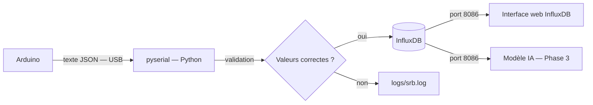
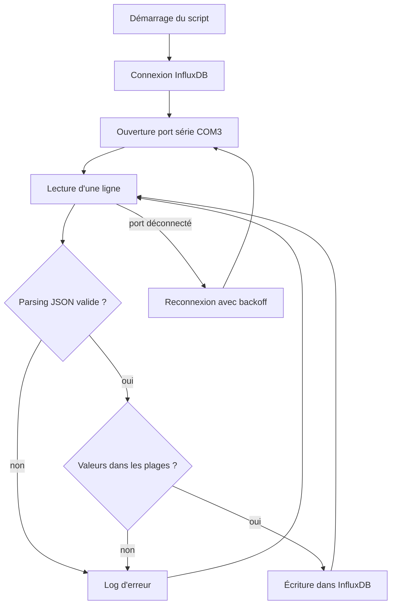

# 03 — Acquisition & Stockage des données

## La chaîne complète



---

## 🐍 pyserial — Lire le port USB

### Ce qu'est un "port série"

Quand on branche l'Arduino en USB, Windows le voit comme un port de communication série — il lui attribue un nom comme `COM3` ou `COM4`. Ce n'est pas un disque dur, c'est un **tube de communication bidirectionnel**.

💡 **Analogie :** Imagine un walkie-talkie branché par câble. L'Arduino parle dans le walkie-talkie, Python écoute de l'autre côté. Les données arrivent **ligne par ligne**, dans l'ordre.

### Ce que fait pyserial

C'est la bibliothèque Python qui permet d'ouvrir ce "tube" et de lire les lignes qui arrivent :

```python
import serial

# Ouvrir le port COM3 à 9600 bauds (vitesse de transmission)
ser = serial.Serial("COM3", baudrate=9600, timeout=2)

# Lire une ligne (bloque jusqu'à recevoir \n)
ligne = ser.readline()  # → b'{"ts": 1750000000, "soil_moisture": 45.2, ...}\n'
```

### C'est quoi un "baud" ?

Le baudrate (ici 9600) est la **vitesse de transmission** en bits par seconde. Arduino et Python doivent utiliser la même vitesse, sinon les données sont illisibles — comme deux personnes qui parlent à des vitesses différentes.

9600 bauds est lent mais suffisant : un message JSON de 100 caractères prend environ 10 ms à transmettre, ce qui est largement sous les 15 minutes entre deux mesures.

### Reconnexion automatique

Un problème courant : si l'Arduino est débranché et rebranché, le port série disparaît puis réapparaît. Notre script gère ça avec un **backoff exponentiel** :

```
Tentative 1 → attente 2 s → Tentative 2 → attente 4 s → ... → attente max 60 s
```

💡 **Analogie :** C'est comme rappeler quelqu'un qui ne répond pas : on attend un peu plus longtemps entre chaque essai pour ne pas spammer.

---

## 🗄️ InfluxDB — La base de données temporelle

### Pourquoi pas Excel ou SQLite ?

Une base de données classique (SQLite, MySQL) est faite pour stocker des **entités** : des clients, des produits, des commandes. Elle est efficace pour répondre à "Quel client a commandé quoi ?".

InfluxDB est une base de données **temporelle** (time-series) : elle est optimisée pour stocker et interroger des **mesures horodatées qui se répètent** dans le temps.

| Besoin | Base classique | InfluxDB |
|--------|---------------|----------|
| Stocker 10 000 mesures de capteur | Possible mais lent | Natif et rapide |
| "Quelle était la T° moyenne cette semaine ?" | Requête complexe | Requête simple |
| Compresser automatiquement les anciennes données | Non | Oui (retention policies) |
| Afficher un graphique de série temporelle | Outils tiers | Interface intégrée |

### Structure d'une donnée dans InfluxDB

```
Measurement : environment
Tags         : station = "SRB-balcon"      ← pour filtrer/regrouper
Fields       : soil_moisture = 45.2        ← valeurs mesurées
               temp_air = 22.1
               humidity_air = 58.0
               lux = 12450.0
Timestamp    : 2026-06-26T14:30:00Z        ← obligatoire
```

- **Measurement** = le nom de la "table" (comme une table SQL)
- **Tags** = étiquettes indexées, pour filtrer rapidement (ex: si on a plusieurs stations)
- **Fields** = les vraies valeurs mesurées (non indexées)
- **Timestamp** = l'horodatage en nanosecondes en interne

### Requête exemple — Flux (le langage d'InfluxDB)

```flux
from(bucket: "srb_sensors")
  |> range(start: -7d)
  |> filter(fn: (r) => r._measurement == "environment")
  |> filter(fn: (r) => r._field == "temp_air")
  |> mean()
```

→ "Donne-moi la température moyenne de l'air sur les 7 derniers jours."

---

## 🐳 Docker — L'InfluxDB dans une boîte

### Ce qu'est Docker

Docker permet de faire tourner un logiciel (ici InfluxDB) dans un **conteneur** : une boîte isolée qui contient le logiciel ET tout ce dont il a besoin pour fonctionner, sans interférer avec le reste de ton PC.

💡 **Analogie :** Un conteneur Docker, c'est comme une capsule spatiale hermétique. L'astronaute (InfluxDB) a son propre air, sa propre eau, sa propre nourriture. Peu importe l'environnement extérieur, ça fonctionne.

### Pourquoi pas installer InfluxDB directement ?

- InfluxDB v2 est un logiciel complet avec ses propres dépendances système.
- Avec Docker, si on veut tout effacer et recommencer : `docker compose down -v` et c'est parti.
- Avec Docker, on peut facilement migrer le projet sur un autre PC ou un serveur cloud.

### Notre fichier `docker-compose.yml` décortiqué

```yaml
services:
  influxdb:
    image: influxdb:2.7          # L'image officielle InfluxDB version 2.7
    container_name: srb-influxdb # Le nom de notre boîte
    ports:
      - "8086:8086"              # Port PC:Port conteneur — accès via localhost:8086
    environment:
      DOCKER_INFLUXDB_INIT_ORG: SRB              # Notre organisation
      DOCKER_INFLUXDB_INIT_BUCKET: srb_sensors   # Notre "table principale"
      DOCKER_INFLUXDB_INIT_ADMIN_TOKEN: srb-local-dev-token-change-in-prod
```

### Les commandes essentielles

```bash
make infra-up      # Démarrer InfluxDB (en arrière-plan)
make infra-down    # L'arrêter proprement
make infra-logs    # Voir les logs en temps réel

# Ou directement :
docker compose up -d
docker compose down
docker compose logs -f influxdb
```

### L'interface web

Une fois lancé, InfluxDB expose une interface web sur `http://localhost:8086`.
On peut y visualiser les données sous forme de graphiques, écrire des requêtes Flux, et gérer les buckets.

---

## 🐍 Le script `serial_to_db.py` — Ce qu'il fait exactement



### Les validations effectuées

Avant d'écrire en base, chaque mesure est vérifiée :

| Champ | Condition | Si invalide |
|-------|-----------|-------------|
| Champs obligatoires | Tous présents | Rejeté + log warning |
| `soil_moisture` | Entre 0 et 100 | Rejeté + log warning |
| `temp_air` | Entre -10 et 60 °C | Rejeté + log warning |
| `humidity_air` | Entre 0 et 100 | Rejeté + log warning |
| `lux` | Entre 0 et 200 000 | Rejeté + log warning |

⚠️ **Pourquoi valider ?** Un capteur défaillant peut envoyer des valeurs aberrantes (ex: -999 ou 9999). Sans validation, ces fausses données pollueraient la base et fausseraient les prédictions du modèle IA.

### Les logs — `logs/srb.log`

Chaque événement est enregistré en JSON structuré :

```json
{"ts": "2026-06-26T14:30:00+00:00", "level": "INFO",  "module": "acquisition.serial_to_db", "msg": "Point écrit dans InfluxDB", "ts_mesure": 1750000000}
{"ts": "2026-06-26T14:30:01+00:00", "level": "WARNING","module": "acquisition.serial_to_db", "msg": "Valeur hors plage", "field": "temp_air", "value": 99.9}
```

💡 **Pourquoi du JSON dans les logs ?** Pour pouvoir les analyser automatiquement. Un log texte classique est lisible par un humain mais difficile à traiter par un programme. Ici, on peut faire `grep "WARNING" logs/srb.log | python -m json.tool` et avoir une liste propre des anomalies.
