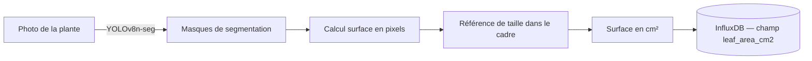

# 04 — Vision par ordinateur

## Pourquoi photographier la plante ?

Les capteurs mesurent l'**environnement** (sol, air, lumière). Mais ils ne mesurent pas **la plante elle-même**.

Pour savoir si la plante pousse bien, on a besoin d'un indicateur visuel de sa croissance. Le plus accessible : la **surface foliaire** — la surface totale de ses feuilles.

Une plante qui pousse bien a plus de feuilles, des feuilles plus grandes. La surface foliaire est donc un **proxy de la biomasse** : une estimation indirecte de la quantité de matière végétale produite.

---

## La surface foliaire — Leaf Area Index

Le **LAI** (Leaf Area Index) est un ratio : surface totale des feuilles divisée par la surface du sol occupée par la plante. Un LAI de 3 signifie que les feuilles couvrent 3 fois la surface au sol.

Dans notre projet, on calcule une version simplifiée : la **proportion de pixels verts** dans la photo qui correspond à des feuilles de pomme de terre — en pixel², convertis en cm² grâce à une référence visuelle dans le cadre.

---

## 🤖 OpenCV — La bibliothèque de traitement d'image

### Ce que c'est

OpenCV (Open Computer Vision) est une bibliothèque Python (et C++) qui contient des centaines d'outils pour manipuler des images : les lire, les redimensionner, changer les couleurs, détecter des contours, flouter, etc.

💡 **Analogie :** OpenCV, c'est la boîte à outils du menuisier. Elle a des marteaux (détection de contours), des scies (découpage de zones), des niveaux (alignement) — mais c'est toi qui décides comment les assembler.

### Exemples d'opérations utiles dans notre projet

```python
import cv2

# Lire une image
img = cv2.imread("photo_plante.jpg")

# Convertir en espace de couleur HSV (Hue-Saturation-Value)
# HSV est plus pratique que RGB pour isoler le "vert"
hsv = cv2.cvtColor(img, cv2.COLOR_BGR2HSV)

# Créer un masque qui ne garde que les pixels verts
vert_min = (35, 40, 40)   # teinte verte minimale en HSV
vert_max = (85, 255, 255)  # teinte verte maximale en HSV
masque = cv2.inRange(hsv, vert_min, vert_max)

# Compter les pixels verts
pixels_verts = cv2.countNonZero(masque)
```

OpenCV seul suffirait pour détecter "le vert", mais il ne saurait pas distinguer **une feuille de pomme de terre** d'une **mauvaise herbe verte** dans le pot.

---

## 🤖 YOLOv8-seg — La détection intelligente des feuilles

### Ce qu'est YOLO

YOLO (You Only Look Once) est une famille de modèles de deep learning spécialisés dans la **détection d'objets dans une image**. La version 8 (YOLOv8) de la société Ultralytics est la plus moderne et la plus accessible.

Il existe plusieurs variantes de YOLOv8 :
- `yolov8n` (nano) — très rapide, moins précis → notre choix pour le PC sans GPU
- `yolov8s` (small) — bon compromis
- `yolov8m` / `yolov8l` / `yolov8x` — de plus en plus précis, de plus en plus lourds

### La variante `-seg` : segmentation

La version `-seg` fait de la **segmentation d'instance** : elle ne dit pas juste "il y a une feuille ici" (détection), elle dessine précisément le contour de chaque feuille (segmentation).



💡 **Analogie :** OpenCV avec un masque vert, c'est comme repasser sur une photo en suivant tout ce qui est vert avec un surligneur. YOLOv8-seg, c'est comme avoir un botaniste expert qui, lui, sait exactement quelles formes sont des feuilles de pomme de terre et dessine leur contour précisément.

### Comment YOLOv8 "sait" reconnaître une feuille de pomme de terre ?

Il a été **pré-entraîné** sur des millions d'images (dataset COCO). Il reconnaît déjà des centaines d'objets courants. Pour les feuilles de pomme de terre spécifiquement, on a deux options :

1. **Option rapide :** utiliser la détection générique "plante" et affiner avec OpenCV.
2. **Option précise :** **fine-tuner** le modèle sur des photos annotées de nos plantes.

On commencera par l'option 1, et si la précision est insuffisante, on basculera vers l'option 2.

### Sans GPU NVIDIA — Fonctionner sur CPU Intel Iris Xe

Notre PC n'a pas de GPU NVIDIA, donc pas de CUDA. YOLOv8 peut quand même tourner sur CPU :

| Mode | Temps d'inférence estimé | Applicable à notre projet |
|------|--------------------------|--------------------------|
| GPU NVIDIA (CUDA) | 10 – 50 ms par image | Non disponible |
| Intel Iris Xe (OpenCL) | 500 ms – 2 s par image | Possible via OpenVINO |
| CPU pur | 2 – 8 s par image | **Notre cas par défaut** |

⚠️ 5 secondes par image, c'est acceptable : on ne traite pas une vidéo en temps réel, juste une photo par jour (ou par semaine).

---

## Ce que le script `image_segmenter.py` produira

### Entrée
- Une photo `.jpg` de la plante, prise manuellement (ou déposée automatiquement par une webcam).

### Traitement
1. Chargement de l'image avec OpenCV.
2. Inférence YOLOv8-seg → masques de segmentation des feuilles.
3. Calcul de la surface totale des masques en pixels.
4. Conversion pixels → cm² (calibration avec une référence dans le cadre, ex: une règle).
5. Horodatage et écriture dans InfluxDB.

### Sortie dans InfluxDB

```
Measurement : plant_vision
Tags         : station = "SRB-balcon", variety = "inconnue"
Fields       : leaf_area_cm2 = 284.5
               leaf_count = 12
               confidence_avg = 0.87
Timestamp    : 2026-06-26T10:00:00Z
```

---

## Conseils pratiques pour les photos

Pour que la segmentation soit fiable :

| Conseil | Pourquoi |
|---------|---------|
| Fond contrasté (sol sombre, gravier blanc) | YOLOv8 segmente mieux les feuilles qui se détachent du fond |
| Lumière homogène, pas de flash direct | Les reflets saturent les pixels et masquent le vert |
| Toujours la même distance et le même angle | Pour que la conversion pixels/cm² reste stable |
| Mettre un objet de référence dans le cadre | Une règle de 20 cm ou un carré de papier A6 |
| Photo prise le matin | Lumière plus douce, feuilles en position ouverte (photosynthèse active) |
