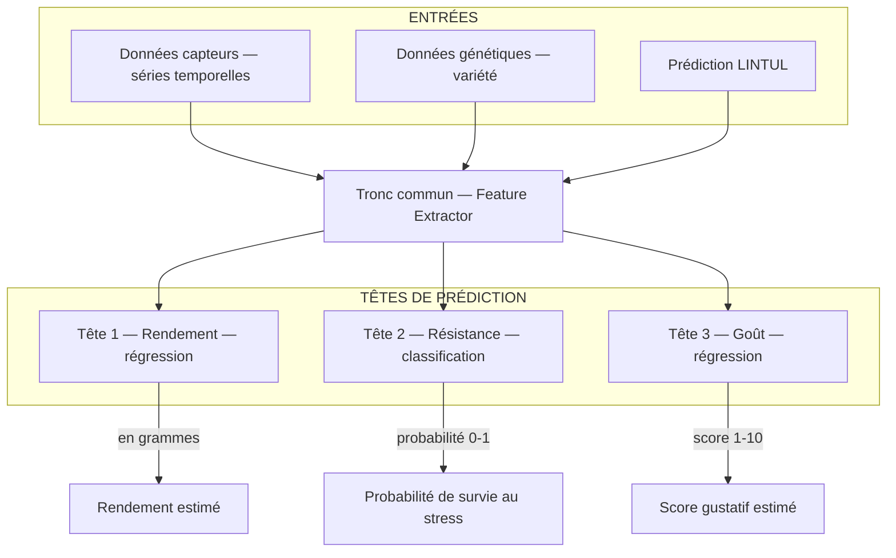

# 05 — Modélisation IA

## Le problème central : peu de données, trois objectifs

La modélisation, c'est le cœur du projet. Mais elle pose un problème fondamental :

| Variable cible | Fréquence de mesure | Exemples disponibles en 1 an |
|---------------|--------------------|-----------------------------|
| **Rendement** | À la récolte (1x / saison) | 1 à 3 par variété |
| **Résistance** | Après un épisode de stress | Rare et imprévisible |
| **Goût** | Après dégustation (subjectif) | 1 à 3 par variété |

Avec aussi peu de données, un modèle IA classique apprendrait n'importe quoi — ou rien du tout. C'est pour ça qu'on utilise une **approche hybride** : combiner un modèle physique (qui "connaît" déjà la biologie de la pomme de terre) avec une IA qui apprend les écarts par rapport à ce modèle.

---

## 🌱 LINTUL-POTATO — Le modèle physique

### Ce que c'est

LINTUL-POTATO est un **modèle de simulation de la croissance de la pomme de terre**, développé par des chercheurs en agronomie. "LINTUL" signifie "Light INTerception and UtiLization".

C'est un modèle **mécaniste** : il simule la croissance en appliquant des équations issues de la biologie végétale connue — pas des statistiques.

💡 **Analogie :** C'est comme un simulateur de vol. Il ne "prédit" pas qu'un avion va monter parce qu'il a observé des milliers d'avions monter. Il calcule la portance à partir des lois de la physique (Bernoulli, Newton). Si le moteur pousse et que les ailes ont la bonne forme, il monte — mathématiquement.

### Ce que LINTUL-POTATO simule

Il prend en entrée :
- La **radiation solaire** (nos données lux du BH1750)
- La **température** (nos données DHT22)
- L'**humidité du sol** (notre capteur sol)
- La **variété** de pomme de terre (coefficients biologiques)

Et il prédit :
- La **biomasse totale** (racines + tiges + feuilles + tubercules) en g/m²
- Le **rendement** en tubercules
- Le **stade phénologique** (germination, croissance, sénescence)

### La limite du modèle physique

LINTUL-POTATO a été calibré sur des champs agricoles en conditions "normales". Un balcon en ville, c'est différent :
- Sol en pot (pas de terre agricole)
- Réflexion des murs et des vitres (lux différent du plein champ)
- Variétés ornementales ou anciennes non calibrées

C'est là qu'intervient l'IA : apprendre l'**écart entre la prédiction physique et la réalité observée**.

---

## 🤖 Architecture Multi-Head — Les trois têtes

### Vue d'ensemble



### Le tronc commun (Feature Extractor)

C'est la partie partagée du modèle. Elle prend toutes les données en entrée et les compresse en une **représentation interne** — un vecteur de nombres qui encode "l'état de la plante".

💡 **Analogie :** C'est comme le bilan de santé d'un médecin. Avant de te dire si tu risques un infarctus, un diabète ou une dépression, le médecin collecte toutes tes données (poids, tension, bilan sanguin, mode de vie) et les "digère" mentalement. Ce travail de synthèse, c'est le tronc commun.

### Tête 1 — Rendement (régression)

**Question :** "Combien de grammes de tubercules cette plante va-t-elle produire ?"

- **Type de tâche :** Régression (prédire un nombre)
- **Données d'entraînement :** Mesures des capteurs + rendement réel à la récolte
- **Influence de LINTUL :** La prédiction physique est utilisée comme point de départ, la tête apprend le delta (écart)

### Tête 2 — Résistance (classification)

**Question :** "Cette plante va-t-elle survivre à cet épisode de stress ?"

- **Type de tâche :** Classification binaire (oui/non) ou probabilité (0.0 → 1.0)
- **Données d'entraînement :** Épisodes de stress identifiés (canicule, sécheresse) + observation de la plante après
- **Exemple :** Stress détecté (T° > 30 °C pendant 3 jours) → la plante a-t-elle récupéré ou flétri ?

### Tête 3 — Goût (régression)

**Question :** "Quel score gustatif peut-on attendre de ces tubercules ?"

- **Type de tâche :** Régression (score de 1 à 10)
- **Données d'entraînement :** Notes de dégustation subjectives (texture, sucre, arôme)
- **Défi principal :** Très peu de données — voir section suivante

---

## ⚠️ Le problème du déséquilibre — La donnée Goût est rare

C'est le problème le plus important du projet. Si on entraîne les trois têtes ensemble avec la même importance :
- La tête Rendement disposera de centaines de points (une mesure par capteur toutes les 15 min)
- La tête Goût disposera de 2 à 5 points par an

**Résultat sans précaution :** Le modèle optimise pour Rendement et Résistance, et la tête Goût apprend n'importe quoi.

### Solutions mises en place

**1. Fine-tuning séquentiel**

```
Étape 1 : Entraîner le tronc + Tête Rendement sur toutes les données disponibles
          → Le tronc apprend à "comprendre" les conditions de culture

Étape 2 : Geler le tronc (ne plus le modifier)
          Entraîner uniquement la Tête Goût sur les rares données gustatives
          → La tête Goût "hérite" de la compréhension du tronc sans la corrompre
```

**2. Pondération des pertes (loss weights)**

Lors d'un entraînement conjoint, on donne plus d'importance à l'erreur de la tête Goût :

```python
loss_total = (
    1.0 * loss_rendement
    + 2.0 * loss_resistance
    + 5.0 * loss_gout        # × 5 car données rares
)
```

**3. Data Augmentation pour la tête Goût**

On génère des variantes artificielles des rares observations disponibles :
- Légère variation aléatoire des conditions (±5 % humidité, ±1 °C)
- Interpolation entre deux observations proches
- Bruit gaussien sur les scores de dégustation

---

## 📚 RAG + ChromaDB — La base de connaissances scientifiques

### Ce qu'est le RAG

RAG signifie **Retrieval-Augmented Generation**. C'est une technique qui permet à un système d'IA d'aller chercher de l'information dans une base documentaire avant de répondre.

Dans notre projet, on n'utilise pas le RAG pour "répondre à des questions" mais pour **enrichir les entrées du modèle** avec des connaissances publiées sur la pomme de terre.

💡 **Analogie :** Imagine un médecin qui, avant de te donner un diagnostic, consulte la base de données PubMed pour trouver les articles scientifiques les plus pertinents sur tes symptômes. Le RAG, c'est ce mécanisme de consultation automatique.

### ChromaDB — La bibliothèque vectorielle

ChromaDB est une base de données spécialisée dans le stockage de **vecteurs** (tableaux de nombres). Ces vecteurs représentent le "sens" d'un texte, encodé par un modèle de langage.

```
Article scientifique → Modèle d'encodage → Vecteur de 768 nombres → ChromaDB
```

Quand le modèle cherche des informations sur "effet de la sécheresse sur la qualité des tubercules", ChromaDB trouve les articles dont le **sens** est proche — même s'ils n'utilisent pas exactement ces mots-là.

### Ce que contient notre RAG

- Publications scientifiques sur LINTUL-POTATO
- Articles sur la phénologie de la pomme de terre (stades de croissance)
- Études sur l'effet du stress hydrique sur le goût
- Données variétales (coefficients biologiques par variété)

---

## 🧮 PyTorch — Le moteur du deep learning

### Ce que c'est

PyTorch est la bibliothèque Python de référence pour le deep learning. Elle fournit :
- Les **tenseurs** : des matrices multidimensionnelles optimisées pour le calcul
- La **différentiation automatique** : le calcul automatique des gradients pour l'entraînement
- Des couches de réseaux neuronaux prêtes à l'emploi

💡 **Analogie :** PyTorch, c'est le moteur d'une voiture. On ne le voit pas directement, mais tout le reste (le modèle Multi-Head) tourne grâce à lui. On n'a pas besoin de savoir comment il fonctionne en détail pour conduire — mais il faut savoir qu'il est là et qu'il consomme de la mémoire GPU (ou CPU dans notre cas).

### Sans GPU NVIDIA

Notre modèle Multi-Head sera entraîné sur **CPU**. C'est plus lent, mais :
- Notre dataset sera petit (quelques centaines de points max par variété)
- On n'entraîne qu'une seule fois, pas en continu
- Avec dask pour paralléliser les simulations LINTUL, le CPU i7-1260P à 12 cœurs est suffisant

---

## 🔀 dask — Paralléliser les simulations

### Ce que c'est

Dask est une bibliothèque Python qui permet de paralléliser des calculs sur plusieurs cœurs CPU.

### À quoi ça sert ici ?

Le simulateur LINTUL-POTATO peut être lancé des centaines de fois avec des paramètres différents (pour tester différentes variétés, différentes conditions). Sans parallélisation, ces simulations seraient séquentielles et lentes. Avec dask, on les lance toutes en parallèle sur les 12 cœurs du i7-1260P.

```python
import dask

# Lancer 100 simulations en parallèle
resultats = dask.compute(*[simuler(variete, conditions) for variete in varietes])
```
