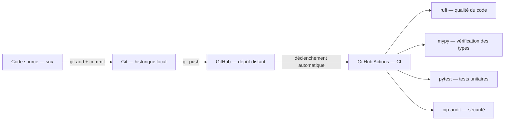
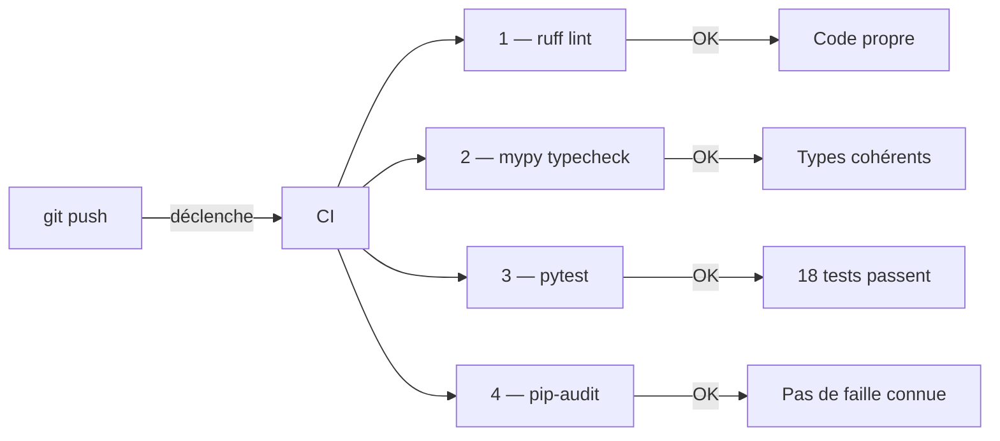

# 06 — Infrastructure de développement

## Vue d'ensemble des outils dev



---

## 🐍 Python 3.12 et l'environnement virtuel `.venv`

### Pourquoi Python 3.12 spécifiquement ?

Python sort une nouvelle version majeure par an. La version 3.12 est :
- La plus récente stable et largement supportée au moment du projet
- Significativement plus rapide que 3.10 (améliorations du bytecode)
- Requise par les versions récentes de `ultralytics` et `langchain`

### Ce qu'est un environnement virtuel

💡 **Analogie :** Imagine que tu as deux projets de jardinage. L'un nécessite de l'engrais de type A en version 1.0, l'autre de l'engrais A en version 2.0 (incompatible avec la v1). Sans sac de rangement séparé, les engrais se mélangent et ça ne marche plus pour aucun des deux projets.

Un environnement virtuel `.venv`, c'est ce sac de rangement : chaque projet a sa propre copie de Python et ses propres bibliothèques, sans interférer avec les autres.

### Les commandes essentielles

```bash
# Activer le venv (à faire à chaque nouvelle session de terminal)
source .venv/Scripts/activate       # Git Bash
.venv\Scripts\Activate.ps1          # PowerShell

# Vérifier qu'on est dans le bon venv
python --version                    # doit afficher Python 3.12.x
which python                        # doit pointer vers .venv/Scripts/python

# Installer une nouvelle dépendance
pip install nom-du-paquet
# ⚠️ Penser à mettre à jour requirements.txt ensuite !
```

---

## 🛠️ Git — L'historique du projet

### Ce que c'est

Git est un système de **contrôle de version** : il enregistre chaque modification du code, avec qui l'a faite, quand, et pourquoi.

💡 **Analogie :** Git, c'est le journal de bord d'un capitaine. Chaque entrée (commit) décrit ce qui a changé ce jour-là. Si quelque chose se passe mal, on peut retrouver exactement quand l'erreur a été introduite et revenir à un état antérieur.

### Les concepts clés

| Concept | Définition simple | Exemple |
|---------|------------------|---------|
| **commit** | Un "instantané" du projet à un moment donné | "Ajout de la validation des températures" |
| **branch** | Une ligne de développement parallèle | Tester une idée sans risquer le code principal |
| **push** | Envoyer ses commits vers GitHub | Mettre à jour le dépôt distant |
| **pull** | Récupérer les commits depuis GitHub | Mettre à jour son code local |

### Notre workflow minimal (projet solo)

```bash
# 1. Modifier du code
# 2. Vérifier ce qui a changé
git diff src/acquisition/serial_to_db.py

# 3. Préparer le commit
git add src/acquisition/serial_to_db.py

# 4. Enregistrer avec un message clair
git commit -m "fix: reconnexion série — gérer le cas port déjà ouvert"

# 5. Envoyer sur GitHub
git push
```

### Le `.gitignore` — Ce qu'on n'envoie PAS sur GitHub

Certains fichiers ne doivent jamais être publiés :

| Fichier | Raison |
|---------|--------|
| `.env` | Contient des tokens secrets (InfluxDB, etc.) |
| `.venv/` | Trop lourd (~500 Mo), chacun le recrée avec `make venv` |
| `logs/` | Données d'exécution locales, pas du code |
| `data/raw/` | Données brutes potentiellement volumineuses |
| `data/models/*.pt` | Modèles entraînés (parfois plusieurs Go) |

---

## 🛠️ GitHub — Le dépôt distant

### Ce que c'est

GitHub est l'hébergeur de notre dépôt Git. C'est là que le code est sauvegardé "dans le cloud", et c'est depuis là que la CI (intégration continue) est déclenchée.

Notre dépôt : `https://github.com/mistwil777/SRB`

### GitHub ≠ Git

| Git | GitHub |
|-----|--------|
| Logiciel installé localement | Service web |
| Gère l'historique des versions | Héberge et partage le dépôt |
| Fonctionne sans internet | Nécessite internet |
| Gratuit et open source | Gratuit pour usage public/perso |

---

## 🛠️ GitHub Actions — La CI (Intégration Continue)

### Ce qu'est la CI

L'**intégration continue** (CI) est un système qui vérifie automatiquement que le code ne régresse pas à chaque modification.

💡 **Analogie :** C'est l'équivalent du contrôle technique d'une voiture. À chaque fois que tu ajoutes une pièce (un commit), un robot fait le tour du véhicule et vérifie que les freins fonctionnent encore, que les feux s'allument, que le niveau d'huile est correct.

### Nos 4 vérifications automatiques



**Job 1 — ruff (lint et formatage)**
Vérifie que le code respecte des règles de style (indentation, imports inutilisés, etc.). Ruff est 10× plus rapide que les anciens outils équivalents (flake8, black).

**Job 2 — mypy (vérification des types)**
Python est un langage "à typage dynamique" : une variable peut changer de type en cours de route. mypy vérifie qu'on n'écrit pas par exemple `temp_air + "°C"` (addition d'un nombre et d'une chaîne), ce qui planterait à l'exécution.

**Job 3 — pytest (tests unitaires)**
Lance automatiquement les tests du dossier `tests/`. Actuellement 18 tests sur la fonction de validation des mesures capteur.

**Job 4 — pip-audit (sécurité)**
Vérifie que les bibliothèques utilisées n'ont pas de vulnérabilités connues (CVE). C'est un filet de sécurité : si une faille critique est découverte dans `pyserial`, pip-audit l'alertera.

### Voir les résultats

Sur GitHub → onglet "Actions" → chaque push a son propre rapport avec ✅ ou ❌ par job.

---

## 🛠️ ruff — La qualité du code

### Ce que c'est

ruff est un **linter et formateur** de code Python. Il détecte les problèmes de style et les erreurs courantes.

### Exemples de ce qu'il détecte

```python
# ❌ Import inutilisé (F401)
import os  # os n'est jamais utilisé dans ce fichier

# ❌ Variable définie mais jamais utilisée (F841)
def valider(payload):
    resultat = True  # resultat est défini mais jamais retourné ou utilisé
    return False

# ❌ Comparaison avec None incorrecte (E711)
if valeur == None:  # doit être "is None"
    pass
```

### Commandes

```bash
make lint        # vérifier sans modifier
make lint-fix    # corriger automatiquement ce qui peut l'être
```

---

## 🛠️ mypy — La vérification des types

### Ce que c'est

mypy vérifie que les fonctions reçoivent et retournent bien les types attendus, avant même d'exécuter le code.

### Exemple concret

```python
def valider(payload: dict) -> bool:  # annotation de type
    return payload.get("lux", 0) > 0

valider("texte")  # mypy détecte cette erreur : str n'est pas dict
```

Sans mypy, cette erreur ne se verrait qu'à l'exécution. Avec mypy, elle est détectée statiquement.

---

## 🛠️ pytest — Les tests unitaires

### Ce que c'est

pytest est le framework de test standard en Python. Un **test unitaire** vérifie qu'une fonction précise se comporte comme prévu.

### Exemple d'un test dans notre projet

```python
def test_temperature_trop_haute():
    payload = {"ts": 1700000000, "soil_moisture": 45, "temp_air": 61,
               "humidity_air": 60, "lux": 1000}
    assert validate(payload) is False  # 61°C doit être rejeté
```

### Pourquoi tester du code sans matériel ?

Les capteurs et l'Arduino ne sont pas disponibles en CI (GitHub ne peut pas brancher un Arduino). On **mocke** (simule) les bibliothèques hardware :

```python
# On remplace serial et influxdb_client par des faux objets
sys.modules["serial"] = MagicMock()
sys.modules["influxdb_client"] = MagicMock()
```

Ainsi, on peut tester la logique de validation, de parsing JSON, etc. sans hardware réel.

---

## 🛠️ Le Makefile — Raccourcis de commandes

### Ce que c'est

Un Makefile centralise les commandes fréquentes du projet. Au lieu de retaper des commandes longues, on écrit juste `make <cible>`.

### Résumé des cibles

```bash
make help        # Afficher toutes les cibles disponibles
make venv        # Recréer le venv Python 3.12 de zéro
make install     # Installer toutes les dépendances prod
make lint        # Vérifier la qualité du code
make lint-fix    # Corriger automatiquement
make typecheck   # Vérifier les types
make test        # Lancer les 18 tests
make audit       # Audit de sécurité des dépendances
make infra-up    # Démarrer InfluxDB (Docker)
make infra-down  # Arrêter InfluxDB
make infra-logs  # Voir les logs InfluxDB en direct
make acquire     # Lancer le script d'acquisition Arduino
make clean       # Nettoyer les caches Python
```

---

## Tableau de bord — État de l'environnement

Pour vérifier rapidement que tout fonctionne :

```bash
# Python
python --version                          # Python 3.12.x

# InfluxDB
curl -s http://localhost:8086/health      # {"status":"pass",...}

# Tests
make test                                 # 18 passed

# Arduino (quand branché)
python -c "import serial; print(serial.tools.list_ports.comports())"
```
