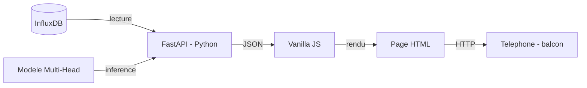

# 07 — Interface web (Phase 4)

## Objectif

Une page web **mobile-first**, consultable depuis le balcon, qui affiche en un coup d'œil :
- L'état actuel de la plante (dernières mesures capteurs)
- Les 3 prédictions du modèle Multi-Head
- La dernière photo annotée par YOLOv8

Pas de framework JS, pas de base de données supplémentaire. Vanilla HTML/CSS/JS servi par FastAPI.

---

## Maquette fonctionnelle

```
┌─────────────────────────────────────┐
│  🥔 SRB — Station Balcon            │
│  Mis à jour il y a 4 min            │
├─────────────────────────────────────┤
│  CAPTEURS          Aujourd'hui      │
│  🌡️  22.4 °C        ████░░  sol 58% │
│  💧  61 %           ☀️  14 200 lux  │
├─────────────────────────────────────┤
│  PRÉDICTIONS DU MODÈLE              │
│                                     │
│  🌾 Rendement       340 g  ± 45 g  │
│  🛡️  Résistance      87 %  confiant │
│  😋 Goût            7.2 / 10       │
├─────────────────────────────────────┤
│  DERNIÈRE PHOTO — 08h12             │
│  [photo annotée — 12 feuilles       │
│   surface : 284 cm²]               │
└─────────────────────────────────────┘
```

---

## Architecture technique



### Backend — FastAPI

3 endpoints suffisent :

| Endpoint | Rôle |
|----------|------|
| `GET /api/sensors/latest` | Dernières mesures InfluxDB |
| `GET /api/predictions` | Inférence du modèle Multi-Head |
| `GET /api/photo/latest` | Dernière image annotée |

### Frontend — Vanilla JS

- Rafraîchissement automatique toutes les 5 minutes
- Affichage de la confiance du modèle (barre de progression)
- Responsive — une colonne sur mobile, deux sur desktop
- CSS variables pour le thème (vert foncé / terre)

---

## Ce qu'on attend avant de démarrer

- ✅ Données dans InfluxDB (synthétiques ou réelles)
- 🔲 Modèle Multi-Head entraîné (Phase 3)
- 🔲 `image_segmenter.py` fonctionnel (Phase 2)

La Phase 4 est la dernière — elle agrège tout ce que les phases précédentes produisent.
